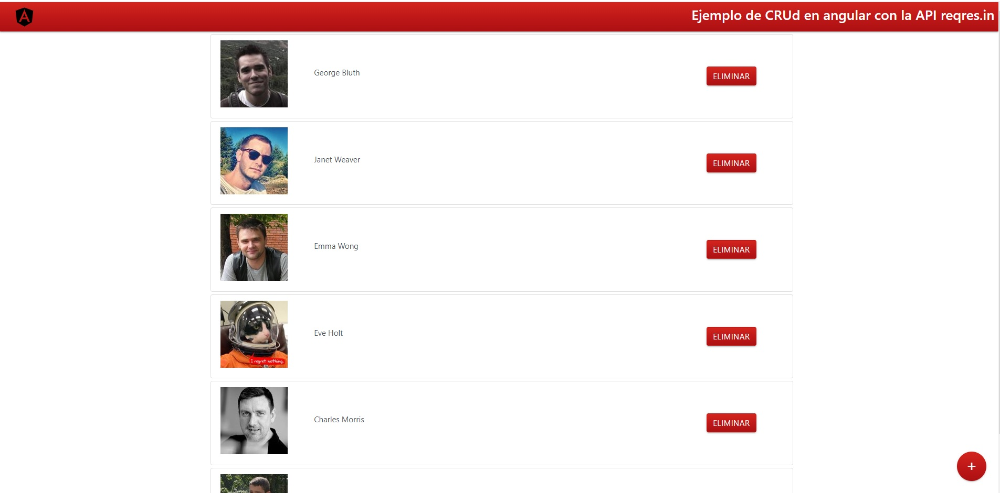

# reqres-angular

Ejemplo de CRUD realizando en Angular utilizando la API reqres.in

> **UPDATE 07/01/2020:**: Repositorio actualizado.

Imagen Principal Artículo 

## Instalacion de dependencias
1. Ejecutar comando `npm install`.
2. `npm install materialize-css --save`
3. `npm install bootstrap jquery popper --save`

## Ejecutar en Local
Ejecutar comando `ng serve -o`. La aplicacion se abrira automaticamente en el navegador.

## construir para su distribucion en Prod.
Ejecutar `ng build` para construir el proyecto en la carpeta `dist/`. Usar el parametro `-prod` en el comando para su construccion en produccion.

## Pruebas
Ejecutar `ng test` para probar en entornos de Test via [Karma](https://karma-runner.github.io).

## Pruebas Unitarias
Ejecutar `ng e2e` realizar pruebas unitarias via [Protractor](http://www.protractortest.org/).

## Ayuda
Para mas informacion de Angular CLI usar `ng help` o ir a [Angular CLI README](https://github.com/angular/angular-cli/blob/master/README.md).
